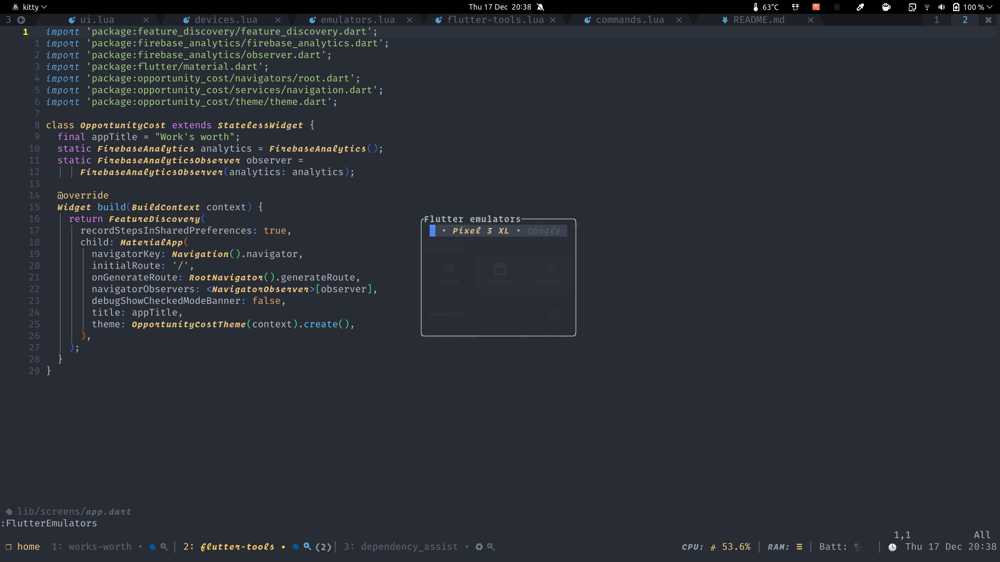

# flutter-tools.nvim

Tools to help create flutter apps in neovim using the native lsp

**Status: WIP**

# Inspiration

This plugin draws inspiration from [`coc-flutter`](https://github.com/iamcco/coc-flutter) and [`nvim-metals`](https://github.com/scalameta/nvim-metals), the idea being
to allow users to easily develop flutter apps using neovim.

## Installation

using `vim-plug`

```vim
Plug "neovim/nvim-lspconfig"
Plug "akinsho/flutter-tools.nvim"
```

or using `packer.nvim`

```lua
use {"akinsho/flutter-tools.nvim", requires = {"neovim/nvim-lspconfig"}}
```

Currently this plugin depends on `nvim-lspconfig` for some default setup this might change.
To set it up

```lua
require("flutter-tools").setup{} -- use defaults

-- alternatively you can override the default configs
require("flutter-tools").setup {
  flutter_outline = {
    highlight = "NonText",
    enabled = false,
  },
  closing_tags = {
    highlight = "ErrorMsg",
    prefix = ">"
  },
  dev_log = {
    open_cmd = "tabedit",
  },
  outline = {
    open_cmd = "30vnew",
  }
  lsp = {
    on_attach = my_custom_on_attach,
    capabilities = my_custom_capabilities -- e.g. lsp_status capabilities
  }
}
```

You can override any options available in the `lspconfig` setup, this call essentially wraps
it and adds some extra `flutter` specific handlers and utilisation options.

# Functionality

#### Run flutter app with hot reloading


#### Start emulators or connected devices



#### Visualise logs


#### Widget outlines


#### Outline window


#### Closing Tags


# Usage

- `FlutterRun` - Run the current project. This needs to be run from within a flutter project.
- `FlutterDevices` - Brings up a list of connected devices to select from.
- `FlutterEmulators` - Similar to devices but shows a list of emulators to choose from.
- `FlutterReload` - Reload the running project
- `FlutterRestart` - Restart the current project
- `FlutterQuit` - Ends a running session
- `FlutterOutline` - Opens an outline window showing the widget tree for the given file

### TODO

- [ ] Connect + open devtools
- [ ] Close emulators and kill all processes on `VimLeave`
- [ ] Integrate with `nvim-dap`

- [x] Auto-scroll dev log
- [x] Add notification when restarting or reloading
- [x] LSP Outline window
- [x] LSP Closing Tags
