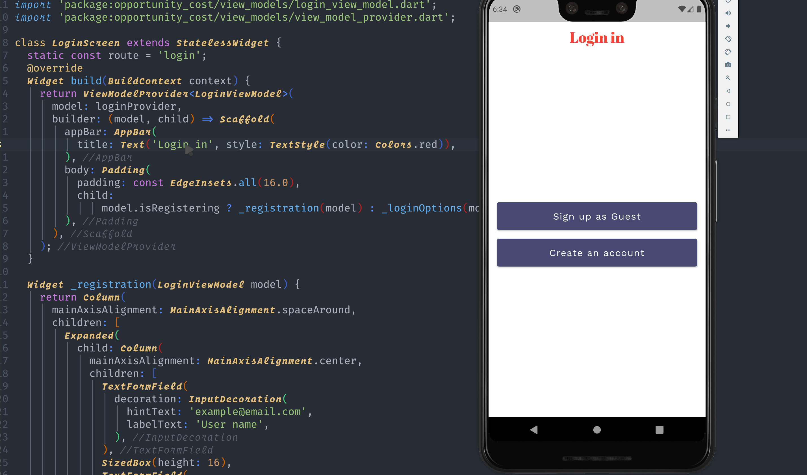
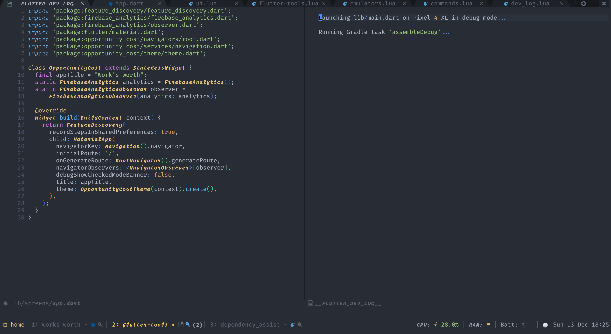
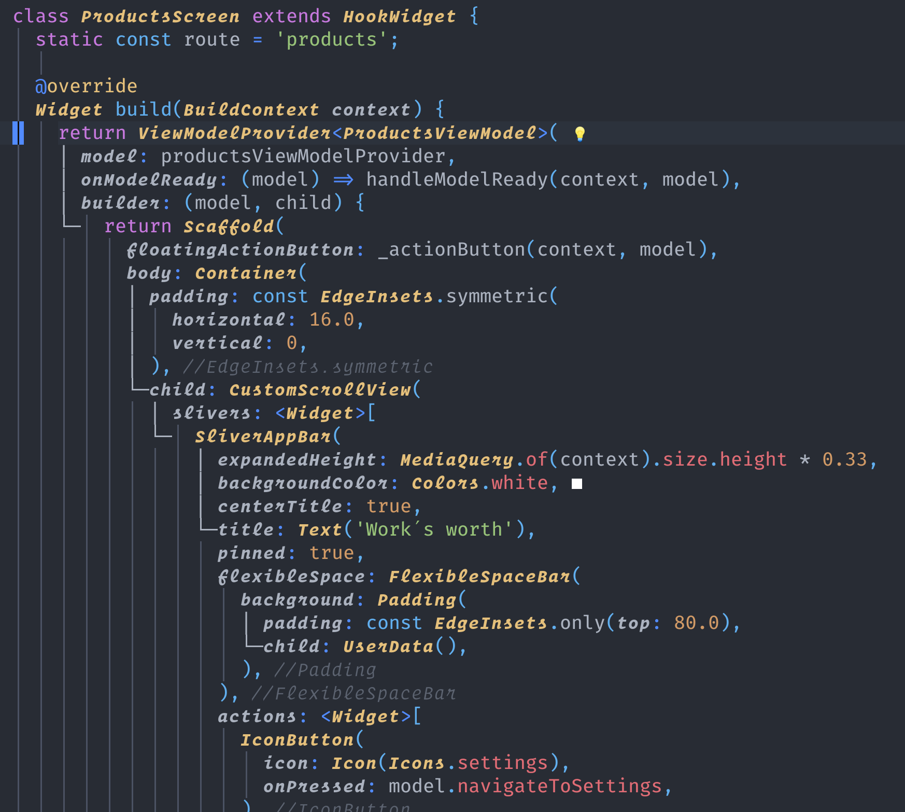
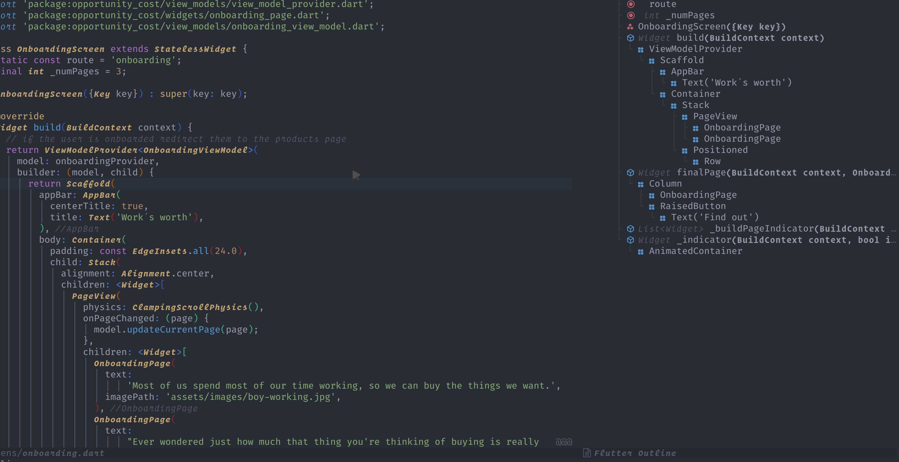
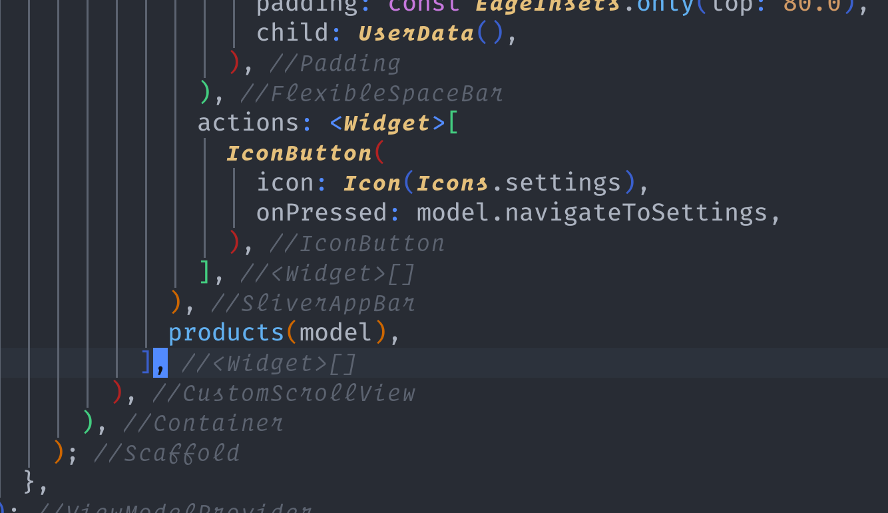

# flutter-tools.nvim

Build flutter and dart applications in neovim using the native LSP. It adds the ability to easily
launch flutter applications, debug them, as well as extending/exposing LSP functionality such as the
widget guides, an outline view of your widgets, and hot reloading.

This plugin draws inspiration from [`emacs-lsp/lsp-dart`](https://github.com/emacs-lsp/lsp-dart), [`coc-flutter`](https://github.com/iamcco/coc-flutter) and [`nvim-metals`](https://github.com/scalameta/nvim-metals).

## New to Neovim's LSP Client?

_Skip this section if you have already configured nvim lsp._

If you haven't set up nvim's lsp client before there are a few things you should know/steps to follow
before setting up this plugin.

This plugin only enhances and adds to the functionality provided by nvim. **It does not by itself provide autocompletion, code actions
or configure how errors from the language server are displayed**. This is all handled by configuring the lsp client.

This plugin handles things like starting and managing flutter application processes allowing for hot reloading, hot restarting,
selecting devices/emulators to run as well as niceties like an outline window, widget guides etc. Other core lsp functionality has to be
configured via nvim lsp.

To set up the lsp client please read the lsp documentation this can be found in `:h lsp` as well `nvim-lspconfig`'s [README](https://github.com/neovim/nvim-lspconfig#lsp-overview)
which provides information on how to setup _autocompletion_ and _code-actions_, those are not configured via this plugin 🙏.

A minimal native LSP configuration might look like:

```vim
 " Show hover
nnoremap K <Cmd>lua vim.lsp.buf.hover()<CR>
 " Jump to definition
nnoremap gd <Cmd>lua vim.lsp.buf.definition()<CR>
 " Open code actions using the default lsp UI, if you want to change this please see the plugins above
nnoremap <leader>ca <Cmd>lua vim.lsp.buf.code_action()<CR>
 " Open code actions for the selected visual range
xnoremap <leader>ca <Cmd>lua vim.lsp.buf.range_code_action()<CR>
```

Please note this is not a replacement for reading the documentation, this is only to show new users what
some basic setup might look like.

## Prerequisites

- neovim 0.8.0+

## Installation

using `vim-plug`

```vim
Plug 'nvim-lua/plenary.nvim'
Plug 'stevearc/dressing.nvim' " optional for vim.ui.select
Plug 'akinsho/flutter-tools.nvim'
```

using `packer.nvim`

```lua
use {
    'akinsho/flutter-tools.nvim',
    requires = {
        'nvim-lua/plenary.nvim',
        'stevearc/dressing.nvim', -- optional for vim.ui.select
    },
}
```

using `lazy.nvim`

```lua
{
    'akinsho/flutter-tools.nvim',
    lazy = false,
    dependencies = {
        'nvim-lua/plenary.nvim',
        'stevearc/dressing.nvim', -- optional for vim.ui.select
    },
    config = true,
}
```

This plugin depends on [plenary.nvim](https://github.com/nvim-lua/plenary.nvim), please make sure it is installed.

This plugin depends on `vim.ui.select` which allows users to control what UI is used for selecting
from a list of options. If you don't have a UI configured for `vim.ui.select` then I highly recommend
the excellent [dressing.nvim](https://github.com/stevearc/dressing.nvim).

## Warning

- flutter tools does not depend on `nvim-lspconfig`. The two can co-exist but please ensure
  you do **NOT** configure `dartls` using `lspconfig`. It will be automatically set up by this
  plugin instead.

- You might encounter issues using this plugin on the `master` channel of flutter.

## Setup

### Vimscript

```vim
lua << EOF
  require("flutter-tools").setup {} -- use defaults
EOF

```

### Lua

```lua
require("flutter-tools").setup {} -- use defaults
```

## Features

#### Run flutter app with hot reloading



#### Start emulators or connected devices


#### Visualise colours from LSP


#### Visualise logs



#### Widget guides (experimental, default: disabled)



#### Outline window



#### Closing Tags



### Statusline decorations

#### App version


# Usage

- `FlutterRun` - Run the current project. This needs to be run from within a flutter project.
- `FlutterDevices` - Brings up a list of connected devices to select from.
- `FlutterEmulators` - Similar to devices but shows a list of emulators to choose from.
- `FlutterReload` - Reload the running project.
- `FlutterRestart` - Restart the current project.
- `FlutterQuit` - Ends a running session.
- `FlutterDetach` - Ends a running session locally but keeps the process running on the device.
- `FlutterOutlineToggle` - Toggle the outline window showing the widget tree for the given file.
- `FlutterOutlineOpen` - Opens an outline window showing the widget tree for the given file.
- `FlutterDevTools` - Starts a Dart Dev Tools server.
- `FlutterDevToolsActivate` - Activates a Dart Dev Tools server.
- `FlutterCopyProfilerUrl` - Copies the profiler url to your system clipboard (+ register). Note that commands `FlutterRun` and
  `FlutterDevTools` must be executed first.
- `FlutterLspRestart` - This command restarts the dart language server, and is intended for situations where it begins to work incorrectly.
- `FlutterSuper` - Go to super class, method using custom LSP method `dart/textDocument/super`.
- `FlutterReanalyze` - Forces LSP server reanalyze using custom LSP method `dart/reanalyze`.
- `FlutterRename` - Renames and updates imports if `lsp.settings.renameFilesWithClasses == "always"`

<hr/>

### `FlutterRun`

The flutter run command can also optionally take arguments that you might otherwise pass on the commandline
such as `:FlutterRun --flavor <tasty>`, `:FlutterRun --no-sound-null-safety`.

<hr/>

## `FlutterOutline`

The outline window allows you to see the high level layout of the current buffer.

### Full Configuration

Please note you do _not_ need to copy and paste this whole block, this is just to show what options are available
You can add keys from the block beneath if there is any behaviour you would like to override or change.

**NOTE:** Only one of `flutter_path` and `flutter_lookup_cmd` should be set. These two keys are two ways of solving the same
problem so will conflict if both are set.

```lua

-- alternatively you can override the default configs
require("flutter-tools").setup {
  ui = {
    -- the border type to use for all floating windows, the same options/formats
    -- used for ":h nvim_open_win" e.g. "single" | "shadow" | {<table-of-eight-chars>}
    border = "rounded",
    -- This determines whether notifications are show with `vim.notify` or with the plugin's custom UI
    -- please note that this option is eventually going to be deprecated and users will need to
    -- depend on plugins like `nvim-notify` instead.
    notification_style = 'native' | 'plugin'
  },
  decorations = {
    statusline = {
      -- set to true to be able use the 'flutter_tools_decorations.app_version' in your statusline
      -- this will show the current version of the flutter app from the pubspec.yaml file
      app_version = false,
      -- set to true to be able use the 'flutter_tools_decorations.device' in your statusline
      -- this will show the currently running device if an application was started with a specific
      -- device
      device = false,
      -- set to true to be able use the 'flutter_tools_decorations.project_config' in your statusline
      -- this will show the currently selected project configuration
      project_config = false,
    }
  },
  debugger = { -- integrate with nvim dap + install dart code debugger
    enabled = false,
    run_via_dap = false, -- use dap instead of a plenary job to run flutter apps
    -- if empty dap will not stop on any exceptions, otherwise it will stop on those specified
    -- see |:help dap.set_exception_breakpoints()| for more info
    exception_breakpoints = {}
    register_configurations = function(paths)
      require("dap").configurations.dart = {
        <put here config that you would find in .vscode/launch.json>
      }
    end,
  },
  flutter_path = "<full/path/if/needed>", -- <-- this takes priority over the lookup
  flutter_lookup_cmd = nil, -- example "dirname $(which flutter)" or "asdf where flutter"
  fvm = false, -- takes priority over path, uses <workspace>/.fvm/flutter_sdk if enabled
  widget_guides = {
    enabled = false,
  },
  closing_tags = {
    highlight = "ErrorMsg", -- highlight for the closing tag
    prefix = ">", -- character to use for close tag e.g. > Widget
    enabled = true -- set to false to disable
  },
  dev_log = {
    enabled = true,
    notify_errors = false, -- if there is an error whilst running then notify the user
    open_cmd = "tabedit", -- command to use to open the log buffer
  },
  dev_tools = {
    autostart = false, -- autostart devtools server if not detected
    auto_open_browser = false, -- Automatically opens devtools in the browser
  },
  outline = {
    open_cmd = "30vnew", -- command to use to open the outline buffer
    auto_open = false -- if true this will open the outline automatically when it is first populated
  },
  lsp = {
    color = { -- show the derived colours for dart variables
      enabled = false, -- whether or not to highlight color variables at all, only supported on flutter >= 2.10
      background = false, -- highlight the background
      background_color = nil, -- required, when background is transparent (i.e. background_color = { r = 19, g = 17, b = 24},)
      foreground = false, -- highlight the foreground
      virtual_text = true, -- show the highlight using virtual text
      virtual_text_str = "■", -- the virtual text character to highlight
    },
    on_attach = my_custom_on_attach,
    capabilities = my_custom_capabilities -- e.g. lsp_status capabilities
    --- OR you can specify a function to deactivate or change or control how the config is created
    capabilities = function(config)
      config.specificThingIDontWant = false
      return config
    end,
    -- see the link below for details on each option:
    -- https://github.com/dart-lang/sdk/blob/master/pkg/analysis_server/tool/lsp_spec/README.md#client-workspace-configuration
    settings = {
      showTodos = true,
      completeFunctionCalls = true,
      analysisExcludedFolders = {"<path-to-flutter-sdk-packages>"},
      renameFilesWithClasses = "prompt", -- "always"
      enableSnippets = true,
      updateImportsOnRename = true, -- Whether to update imports and other directives when files are renamed. Required for `FlutterRename` command.
    }
  }
}
```

You can override any options available in the `lspconfig` setup, this call essentially wraps
it and adds some extra `flutter` specific handlers and utilisation options.

**NOTE:**
By default this plugin excludes analysis of the packages in the flutter SDK. If for example
you jump to the definition of `StatelessWidget`, the lsp will not try and index the 100s (maybe 1000s) of
files in that directory. If for some reason you would like this behaviour set `analysisExcludedFolders = {}`
You cannot/should not edit the files in the sdk directly so diagnostic analysis of these file is pointless.

**Exclude Note for Windows:**
To ignore packages installed with pub, consider adding `vim.fn.expand("$HOME/AppData/Local/Pub/Cache")` to
`analysisExcludedFolders` if you are using PowerShell.

#### Project Configuration

It is possible to configure how each project is run using neovim's `exrc` functionality (see `:help exrc`).
This allows you to create an exrc file e.g. `.nvim.lua` and put the project configurations inside it.
This is similar _conceptually_ to vscode's `launch.json` file.

```lua
-- .nvim.lua
-- If you have more than one setup configured you will be prompted when you run
-- your app to select which one you want to use
require('flutter-tools').setup_project({
  {
    name = 'Development', -- an arbitrary name that you provide so you can recognise this config
    flavor = 'DevFlavor', -- your flavour
    target = 'lib/main_dev.dart', -- your target
    device = 'pixel6pro', -- the device ID, which you can get by running `flutter devices`
    dart_define = {
      API_URL = 'https://dev.example.com/api',
      IS_DEV = true,
    },
    dart_define_from_file = 'config.json' -- the path to a JSON configuration file
  },
  {
    name = 'Web',
    device = 'chrome',
    flavor = 'WebApp'
  }
})
```

you can also specify the configuration as an object if there is only one

```lua
require('flutter-tools').setup_project({
  name = 'Development',
  flavor = 'DevFlavor',
  device = 'pixel6pro',
  target = 'lib/main_dev.dart',
  dart_define = { ... },
  dart_define_from_file = 'config.json'
})
```

#### Flutter binary

In order to run flutter commands you _might_ need to pass either a _path_ or a _command_ to the plugin so it can find your
installation of flutter. Most people will not need this since it will find the executable path of `flutter` if it is in your `$PATH`.

If using something like `asdf` or some other version manager or in some other custom way,
then you need to pass in a command by specifying `flutter_lookup_cmd = <my-command>`.
If you have a full path already you can pass it in using `flutter_path`.

If you are on linux and using `snap`, this plugin will automatically set the `flutter_lookup_cmd` to `flutter sdk-path` which allows finding
`snap` installations of flutter. If this doesn't work for any reason likely an old version of flutter before this command
was added, you can set your `flutter_path` to `"<INSERT-HOME-DIRECTORY>/snap/flutter/common/flutter/bin/flutter"`
which is where this is usually installed by `snap`.

### Highlights

Highlight groups that are user configurable to change the appearance of certain UI elements.

- `FlutterToolsOutlineIndentGuides` - indent guides for the outline window

#### Widget guides

To configure the highlight colour you can override the `FlutterWidgetGuides` highlight group.

### Statusline decorations

You can add metadata about the flutter application to your statusline using the `g:flutter_tools_decorations`
dictionary that is created if you have set any of the decorations to `true` in your configuration.

The currently supported decorations are:

- App version - The current version of the app from the `pubspec.yaml`.
- Device - the device passed to the flutter run command

To add them to your config you can do something like

```lua
function _G.statusLine()
  return vim.g.flutter_tools_decorations.app_version
end
vim.opt.statusline ='%!v:statusLine()'
```

see `:h statusline` for more information on how to create a statusline.

### Telescope Integration


You can list available commands in this plugin using [telescope.nvim](https://github.com/nvim-telescope/telescope.nvim).

In order to set this up, you can explicitly load the extension.

```lua
require("telescope").load_extension("flutter")
```

Or alternatively telescope can lazy load extension but the `Telescope` command will not autocomplete lazy loaded modules.

This can be accessed using `Telescope flutter commands` or `require('telescope').extensions.flutter.commands()`

#### FVM


If you have [fvm](https://fvm.app/) installed and enabled in your config, you can change your Flutter SDK via a Telescope picker.

This can be accessed using `Telescope flutter fvm` or `require('telescope').extensions.flutter.fvm()`

## Debugging

_Requires nvim-dap_

```lua
-- with packer
use 'mfussenegger/nvim-dap'
```

This plugin integrates with [nvim-dap](https://github.com/mfussenegger/nvim-dap) to provide debug capabilities.
Currently if `debugger.enabled` is set to `true` in the user's config **it will expect `nvim-dap` to be installed**.
If `dap` is this plugin will use `flutter` or `dart` native debugger to debug your project.

To use the debugger you need to run `:lua require('dap').continue()<CR>`. This will start your app. You should then be able
to use `dap` commands to begin to debug it. For more information on how to use `nvim-dap` please read the project's README
or see `:h dap`. Note that running the app this way will prevent commands such as `:FlutterRestart`, `:FlutterReload` from working.

Alternatively, if you prefer always running your app via dap, you can set `debugger.run_via_dap = true` in your config.
This way you benefit from the debugging abilities of DAP, AND you can still use `:FlutterRestart`, `:FlutterReload`, etc.

You can use the `debugger.register_configurations` to register custom runner configuration (for example for different targets or flavor).
If your flutter repo contains launch configurations in `.vscode/launch.json` you can use them via this config :

```lua
  debugger = {
    enabled = true,
    register_configurations = function(_)
      require("dap").configurations.dart = {}
      require("dap.ext.vscode").load_launchjs()
    end,
  },
```

Since there is an overlap between this plugin's log buffer and the repl buffer when running via dap, you may use the `dev_log.enabled` configuration option if you want.

Also see:

- [nvim-dap-ui](https://github.com/rcarriga/nvim-dap-ui) - a plugin which provides a nice UI for `nvim-dap`.

## FAQ

### The LSP isn't starting what do I do?

One of the commonest reasons this happens is that for some reason your local flutter binary either can't be found or is throwing an error.
You can see the output of this by checking the lsp logs. You can do this by running

```vim
:lua vim.cmd('edit '..vim.lsp.get_log_path())<CR>
```

This will open your lsp logs. You can then check for any error messages.
